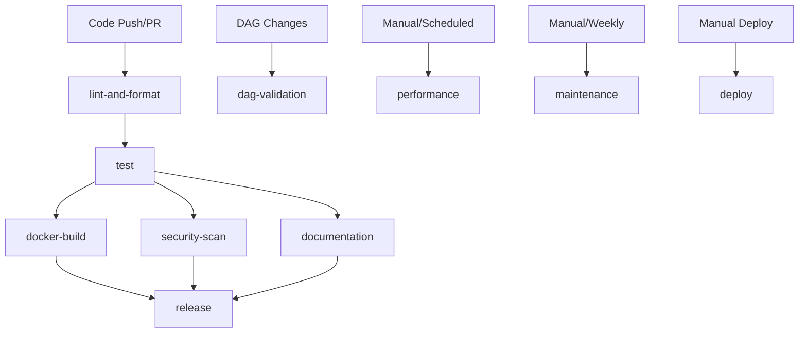

# GitHub Actions Workflows Documentation

This document describes all the GitHub Actions workflows configured for the GenETL project.

## Workflow Overview

### 1. Main CI/CD Pipeline (`ci-cd.yml`)
**Triggers:** Push to main/develop, Pull Requests
**Purpose:** Complete continuous integration and deployment pipeline

#### Jobs:
- **Code Quality & Formatting:** Black, isort, flake8, bandit, safety, mypy
- **Unit & Integration Tests:** Python 3.11, PostgreSQL 12.6, Redis 7
- **Docker Build & Integration:** Full container testing with Apache Airflow 2.7.3
- **Security & Vulnerability Scan:** Trivy, Semgrep, dependency scanning
- **Documentation Validation:** Check required docs and project structure
- **Release Management:** Automated releases with semantic versioning
- **Pipeline Summary:** Detailed reporting and notifications

#### Key Features:
- ✅ Updated to Python 3.11 and Airflow 2.7.3
- ✅ Uses official Apache Airflow image instead of Astro Runtime
- ✅ Comprehensive security scanning with multiple tools
- ✅ Proper port configuration (5433 for PostgreSQL, 8888 for webserver)
- ✅ Intelligent caching and dependency management
- ✅ Detailed pipeline summaries and GitHub step summaries

### 2. DAG Validation (`dag-validation.yml`)
**Triggers:** Changes to dags/, include/, plugins/ directories
**Purpose:** Validate Airflow DAGs for syntax and integrity

#### Features:
- Python syntax validation
- Airflow DAG integrity checks
- Circular dependency detection
- Automatic DAG documentation generation
- Import error reporting

### 3. Deployment (`deploy.yml`)
**Triggers:** Manual workflow dispatch
**Purpose:** Deploy to different environments (dev/staging/production)

#### Features:
- Multi-environment deployment support
- Generated Docker Compose configurations
- Deployment scripts and backup utilities
- Environment-specific configurations
- Deployment package artifacts

### 4. Performance & Monitoring (`performance.yml`)
**Triggers:** Daily scheduled, Manual dispatch, Changes to dags/
**Purpose:** Performance testing and system monitoring

#### Features:
- DAG loading time measurement
- Memory and CPU usage analysis
- Database performance checks
- Resource monitoring
- Performance threshold alerts
- Detailed performance reports

### 5. Maintenance & Cleanup (`maintenance.yml`)
**Triggers:** Weekly scheduled, Manual dispatch
**Purpose:** System maintenance and cleanup operations

#### Features:
- Repository cleanup analysis
- Dependency security audits
- Log and artifact cleanup recommendations
- Database maintenance suggestions
- Automated cleanup scripts
- Weekly maintenance checklists

## Configuration Updates Made

### 1. Modernized Technology Stack
- **Python:** Updated from 3.8 to 3.11
- **Airflow:** Updated to 2.7.3 (official Apache image)
- **PostgreSQL:** Standardized on 12.6 for compatibility
- **Actions:** Updated to latest versions (setup-python@v5, checkout@v4)

### 2. Fixed Port Configurations
- **PostgreSQL:** 5433 (external) → 5432 (internal)
- **Airflow Webserver:** 8888 (external) → 8080 (internal)
- **Redis:** 6379 (standard Redis port)

### 3. Enhanced Security
- Multiple security scanning tools (Bandit, Safety, Semgrep, Trivy)
- Dependency vulnerability checks
- SARIF report uploads to GitHub Security tab
- Secure environment variable handling

### 4. Improved Reliability
- Removed problematic Astro Runtime dependencies
- Simplified Docker configurations
- Better error handling and retry logic
- Comprehensive health checks

### 5. Better Developer Experience
- Detailed pipeline summaries
- Artifact uploads for reports and packages
- Manual workflow triggers with parameters
- Comprehensive documentation generation

## Environment Variables Required

### CI/CD Pipeline
```bash
# Automatically provided by GitHub Actions
GITHUB_TOKEN  # For releases and artifacts

# Database (handled by services)
POSTGRES_USER=airflow
POSTGRES_PASSWORD=test_password_ci  # CI only
POSTGRES_DB=airflow

# Airflow
AIRFLOW__CORE__FERNET_KEY=zP0KVBMjQ0zIbD3fkGjHxhjNZNUHq2okB2Lp3fkF1RY=
```

### Deployment (Per Environment)
```bash
# Production secrets (configure in GitHub Environments)
POSTGRES_USER=production_user
POSTGRES_PASSWORD=secure_production_password
POSTGRES_DB=genetl_prod
AIRFLOW_FERNET_KEY=production_fernet_key
AIRFLOW_ADMIN_PASSWORD=secure_admin_password
```

## Workflow Dependencies



## Best Practices Implemented

### 1. Security
- No hardcoded credentials in production workflows
- Separate CI and production configurations
- Security scanning on every change
- Automated dependency vulnerability checks

### 2. Performance
- Efficient caching strategies
- Parallel job execution where possible
- Resource monitoring and alerting
- Performance regression detection

### 3. Reliability
- Comprehensive testing at multiple levels
- Health checks and retry logic
- Graceful error handling
- Rollback capabilities in deployment

### 4. Maintainability
- Clear documentation and naming
- Modular workflow design
- Automated maintenance tasks
- Regular dependency updates

## Usage Instructions

### Running Workflows Locally
While these workflows are designed for GitHub Actions, you can test components locally:

```bash
# Test DAG validation
python -m pytest tests/ -v

# Test Docker build
docker compose -f docker-compose.ci.yml up --build

# Run security scans
safety check
bandit -r .
```

### Manual Workflow Triggers
1. **Deploy:** Go to Actions → Deploy to Environment → Run workflow
2. **Performance Test:** Actions → Performance & Monitoring → Run workflow  
3. **Maintenance:** Actions → Maintenance & Cleanup → Run workflow

### Monitoring Workflow Results
- Check the Actions tab for workflow status
- Download artifacts for detailed reports
- Review security scan results in the Security tab
- Monitor performance trends over time

## Troubleshooting

### Common Issues
1. **Port conflicts:** Ensure no other services are using ports 5433, 8888
2. **Memory issues:** Increase runner resources for large DAG loads
3. **Docker build failures:** Check Dockerfile and requirements.txt syntax
4. **Security scan failures:** Review and fix reported vulnerabilities

### Getting Help
1. Check workflow logs for specific error messages
2. Review the troubleshooting sections in individual workflows
3. Check GitHub Actions documentation for runner issues
4. File issues in the repository for workflow-specific problems

## Future Enhancements

### Planned Improvements
- Integration with external monitoring systems (Prometheus/Grafana)
- Automated performance regression notifications
- Advanced deployment strategies (blue/green, canary)
- Integration testing with external APIs
- Automated backup and disaster recovery testing

### Metrics and KPIs
- Build success rate and duration
- Test coverage trends
- Security vulnerability resolution time
- Deployment frequency and success rate
- Performance metric trends